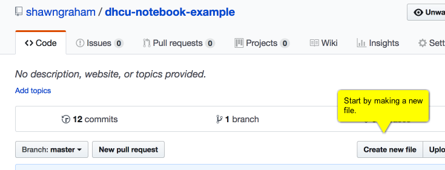
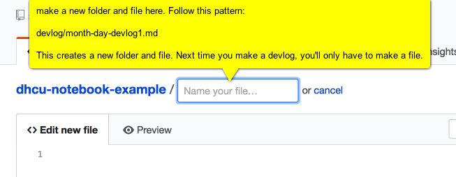
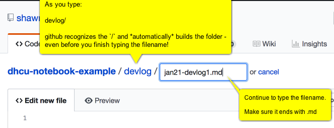
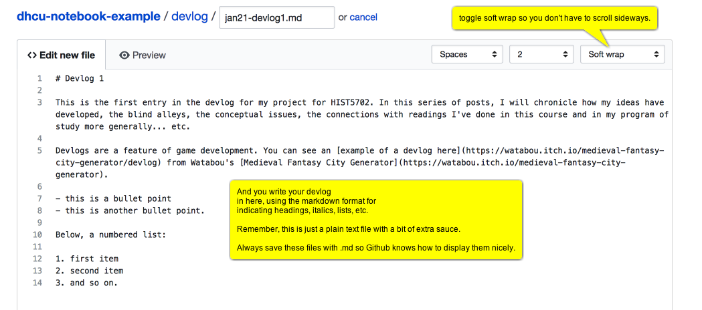
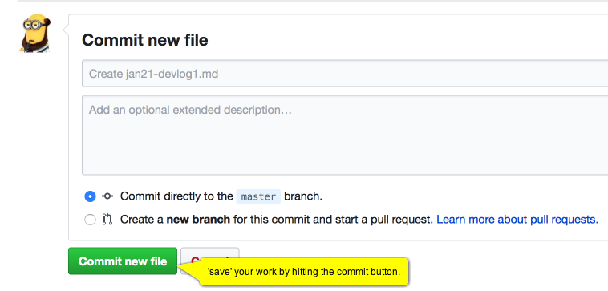
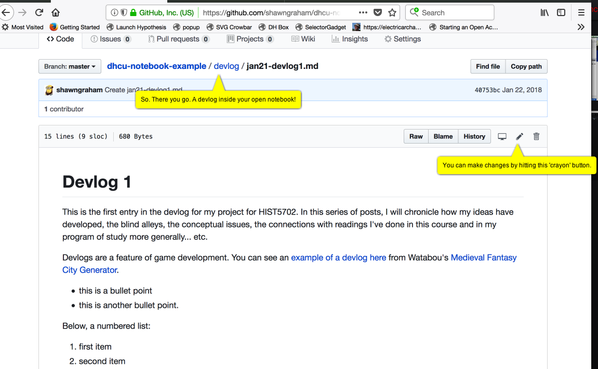

# How to make your devlog

The devlog is just a series of text files that chronicle the evolution of your project.

The devlog can have pretty much anything in it, but it should detail not only the things you've done, but why you've done them, the problems, and where you intend to go next.

The entries in the devlog can be combined, harvested, mixed up, and so on, in order to create the paradata for the final project when the time comes.

Ten entries. These entries are your own personal notes on what you're doing, what you're reading, what you're drawing on, and why. In an ideal world, these would let someone else reproduce your project (recreate it from scratch and arrive at the same thing) and replicate it (follow your method on a different body of evidence). These can be a mixture of bullet points and narrative, however you like. You need to also create a repo just for your project materials itself, and keep everything you build there.

Here's how to make one in github. I've chosen to set it up as a `subdirectory` of the main `notebook` repository. You could just make it a separate repository if you wished (to do that, click on the `+` button on the top right of the screen and follow instructions. Make sure to select `initialize with a readme file` when it asks you.)

## Make a new folder and the first devlog file

## Github is smart enough to recognize that you want a new folder

## Start writing your first entry

## Commit - save - your changes

## Review

## Moving forward

Now, when you want to make your next devlog entry, just go to this repository and subfolder, hit the 'create new file' button, name the new file appropriately, and begin to write.

